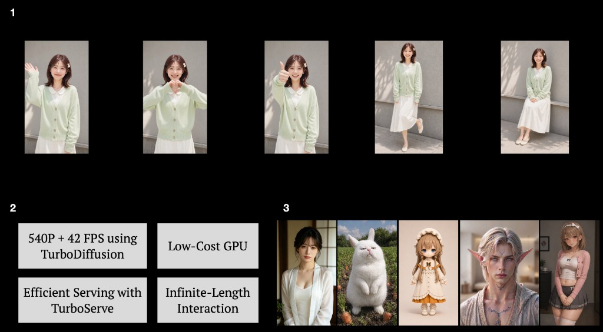

# Vidu-S1

<p align="center">
  <b><font size="8">Vidu S1: A Real-Time Interactive Video Generation Model</font></b>
</p>

<div align="center" style="line-height: 1;">
  <a href="https://vidu.com/vidu-stream">
    
  </a>
  <a href="https://arxiv.org/abs/2607.03118">
    
  </a>
  <a href="#documentation-english">
    
  </a>
  <a href="#documentation-chinese">
    
  </a>
  <a href="#documentation-chinese">
    
  </a>
</div>

<p align="center">
  
</p>

<p align="center">
  
</p>

## Introduction

Vidu S1 is a real-time interactive video generation model for voice-controlled digital characters. Users can guide generated video content at any moment through spoken instructions, enabling live interaction.

Key breakthroughs:

1. **Real-time speech control over video content**
   - Users can directly instruct digital characters to perform actions.
2. **Infinite-length real-time interactive generation**
   - Vidu S1 generates 540p video at up to **42 FPS** and can run on consumer GPUs.
3. **Custom character images and voice tones**
   - Vidu S1 supports real people, anime-style characters, pets, and other personalized avatars.

## Links

### Websites

- **Try Vidu S1**: [vidu.com/vidu-stream](https://vidu.com/vidu-stream)
- **ArXiv Paper**: [arxiv.org/abs/2607.03118](https://arxiv.org/abs/2607.03118)

### Documentation (English)

- **User Guide**: Coming soon.
- **API Documentation**: Coming soon.
- **API Quickstart**: Coming soon.

### Documentation (Chinese)

- **User Guide**: [shengshu.feishu.cn/wiki/PSlDwao9GiEGOKkWS2FcWRtOnwe](https://shengshu.feishu.cn/wiki/PSlDwao9GiEGOKkWS2FcWRtOnwe)
- **API Documentation**: [shengshu.feishu.cn/docx/T9jid9NSio6wSNxaw14c2HKKnKd](https://shengshu.feishu.cn/docx/T9jid9NSio6wSNxaw14c2HKKnKd)
- **API Quickstart**: [shengshu.feishu.cn/wiki/GF2Uw5cGvihTBIk2zgYcKhzGnSf](https://shengshu.feishu.cn/wiki/GF2Uw5cGvihTBIk2zgYcKhzGnSf)

## Updates

- **[2026-07]**: Try Vidu Stream at [vidu.com/vidu-stream](https://vidu.com/vidu-stream).

## Citation

If you find Vidu S1 useful for your research, please cite:

```bibtex
@article{zhang2026vidus1,
  title={Vidu S1: A Real-Time Interactive Video Generation Model},
  author={Zhang, Jintao and Jiang, Kai and Chen, Jintao and Wang, Xu and Luo, Yang and Wang, Yuji and Chen, Dechuang and Li, Jungang and Ye, Chengyang and Chen, Marco and Zhu, Hongzhou and Zhao, Min and Jiang, Yuxuan and Huang, Zhengkun and Xiang, Chendong and Zheng, Kaiwen and Wang, Haoxu and Wang, Xiaohang and Jia, Qi and Chen, Xin and Chen, Yimin and Jiang, Youhe and Fu, Fangcheng and Deng, Zhijie and Bao, Fan and Chen, Jianfei and Zhu, Jun},
  journal={arXiv preprint arXiv:2607.03118},
  year={2026}
}
```
